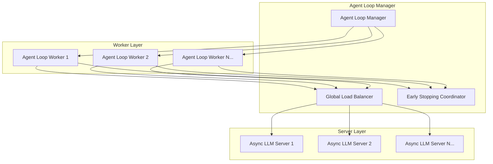
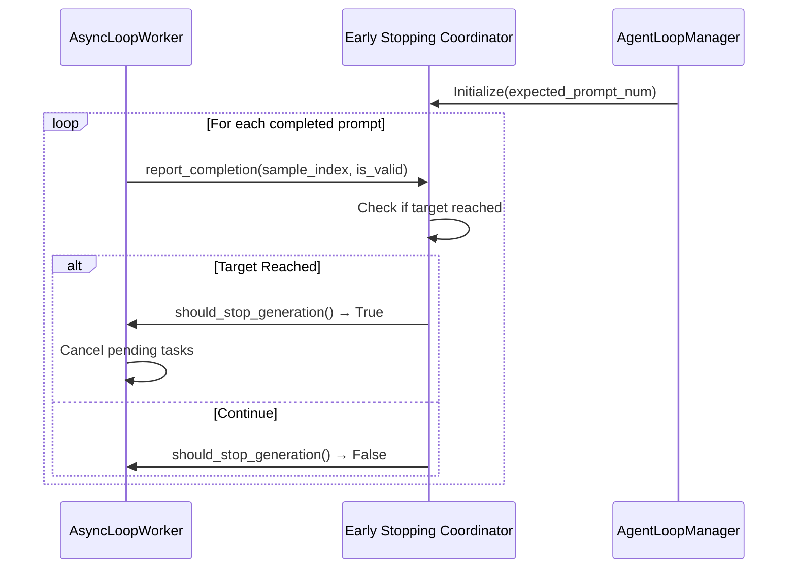
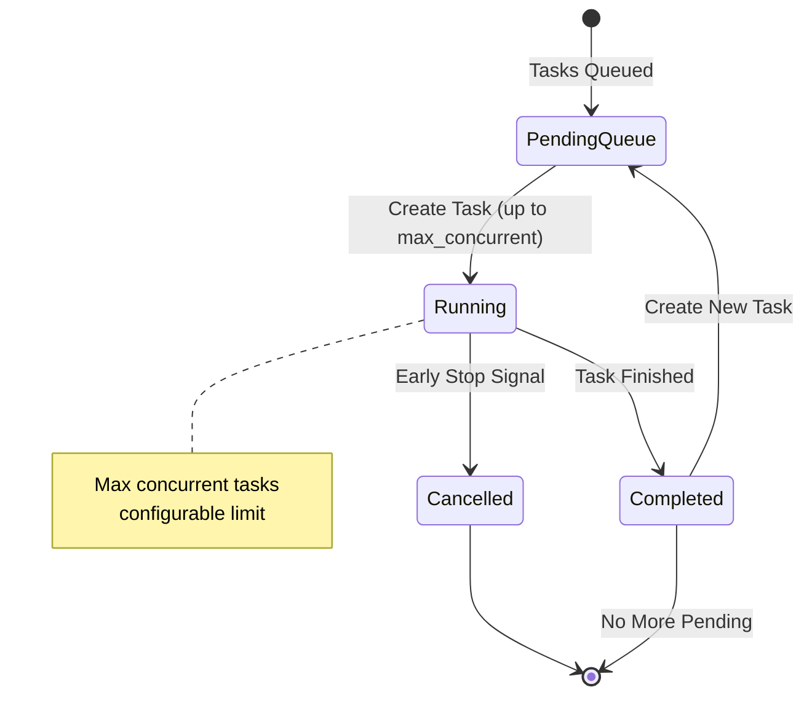

# Async DAPO Recipe

## Overview

Inspired by MiMo, this Async DAPO recipe combines verl's AgentLoop async rollout functionality with the DAPO algorithm to enhance end-to-end training efficiency. This recipe provides efficient distributed processing with intelligent resource management, early stopping mechanisms, and dynamic task scheduling for single-turn RLVR.

## Key Features

- **🚀 Asynchronous Processing**: Non-blocking concurrent request handling for maximum throughput
- **⚡ Early Stopping Mechanism**: Intelligent early termination when a target number of prompts are completed and validated (with a reward variance)
- **🔄 Dynamic Load Balancing**: Global load balancer with real-time server allocation
- **🎯 Seamless Reward Computation & Filtering**: Immediate reward calculation and DAPO-like prompt filtering upon response completion, eliminating the need to wait for entire batch rollout

## Usage

### 0. Install verl

```bash
git clone https://github.com/volcengine/verl
cd verl
# !IMPORTANT: checkout the commit, otherwise there may be incompatibility issues
git checkout 6110410797986ccfbfb375ffdec2453d4ff90e59
pip install -e .
```

### 1. Prepare Data

```bash
export DATA_HOME=${DATA_HOME:-"${HOME}/data"}
bash prepare_dapo_data.sh
```

### 2. Train

We use Qwen3-8B-Base and the DAPO dataset as the model and data. The main training hyperparameters are from DAPO.

```bash
export VLLM_USE_V1=1 
export HOME_DIR=${HOME}
bash test_qwen3_8b.sh
```


## Architecture Overview



## Core Mechanisms

### 1. Seamless Reward Computation & Prompt Filtering

We fused the reward computation and prompt filtering process with the rollout process, so that the reward computation and prompt filtering can be done immediately after the response generation is completed.

This eliminates the need to wait for the entire batch rollout to complete, and allows for early stopping and prompt filtering to be done in a more timely manner.


### 2. Early Stopping Coordination

The Early Stopping Coordinator provides intelligent termination control to optimize training efficiency and prevent unnecessary computation.

**Key Components:**
- **Global State Tracking**: Monitors completed and validated prompts across all workers
- **Signal Propagation**: Broadcasts early stopping signals to all active workers

**Implementation Flow:**



### 3. Global Load Balancing

The Global Load Balancer implements sophisticated server allocation strategies to maximize resource utilization and minimize request latency.

**Load Balancing Strategies:**

#### Semaphore-Based Capacity Control
```python
# Capacity management with threading.Semaphore
total_capacity = max_loads_per_server * num_servers
semaphore = threading.Semaphore(total_capacity)

# Server allocation with load tracking
def get_server_index():
    semaphore.acquire()  # Wait for available capacity
    min_load_server = min(servers, key=lambda s: s.current_load)
    min_load_server.current_load += 1
    return min_load_server.index

# Update the server load after a task is completed
def release_server_index(server_index):
    current_loads[server_index] -= 1
    semaphore.release()
```

### 4. Dynamic Task Management

Each AgentLoopWorker first creates rollout tasks for max_concurrent_prompts number of prompts, then creates a rollout task for the next prompt only when one prompt completes generation.

In this way, FIFO control is implemented on the task sending side, so that the N response generation tasks for each prompt are completed at approximately the same time, followed by subsequent reward calculation and filtering. Otherwise, multiple prompts might only complete partial response generation and block subsequent processing.

**Task Lifecycle Management:**



**Implementation Details:**

```python
# Dynamic task creation with concurrent limit
max_concurrent_tasks = config.max_concurrent_prompts
pending_prompts = list(prompt_groups.items())
pending_tasks = {}

# Create initial batch
for _ in range(min(max_concurrent_tasks, len(pending_prompts))):
    sample_index, group_data = pending_prompts.pop(0)
    task = asyncio.create_task(process_prompt_group(sample_index, group_data))
    pending_tasks[task] = sample_index

# Main processing loop
while pending_tasks:
    # Wait for any task completion
    done, still_pending = await asyncio.wait(
        pending_tasks.keys(), 
        return_when=asyncio.FIRST_COMPLETED
    )
    
    # Process completed tasks and create new ones
    for task in done:
        process_completed_task(task)
        if pending_prompts and not early_stop_triggered:
            create_new_task()
```

## Experiments

The `test_qwen3_8b.sh` script is just a simple example to show how to use this async DAPO recipe.

The following experiments are conducted on multiple nodes and with a larger max_response_length (16k).


- Green Line: using the above async DAPO recipe
- Red Lines: the baseline, using the original AgentLoop async rollout.

From the above figure, we can see that the async DAPO recipe can achieve a similar performance to the baseline, but with a much lower rollout time.

Overall throughput has improved by about 15%, and the time spent in the rollout phase has decreased by 20%.

### Additional Experiment: 8k Max Sequence Length

We conducted an additional experiment using the same Qwen3-8B-Base model but with a reduced max_response_length (8k) to evaluate performance under different sequence length constraints.


- Green Line: using the above async DAPO recipe
- Yellow Lines: the baseline, using the original AgentLoop async rollout.

In this 8k experiment, the async DAPO recipe boosts efficiency and yields stabilized training by favoring shorter and low variance trajectories while saving wasted compute.

## References and Acknowledgments

- [MiMo](https://arxiv.org/abs/2505.07608): We implement the early stopping mechanism and seamless reward computation & filtering based on MiMo's design.
- [DAPO](https://github.com/BytedTsinghua-SIA/DAPO): We use the DAPO dataset as the data.
- [Qwen3-8B-Base](https://huggingface.co/Qwen/Qwen3-8B-Base): We use Qwen3-8B-Base as the model.
- [Irvingwangjr/verl](https://github.com/Irvingwangjr/verl): For the generation cancellation mechanism in the AsyncvLLMServer, we refer to the implementation in this repo.