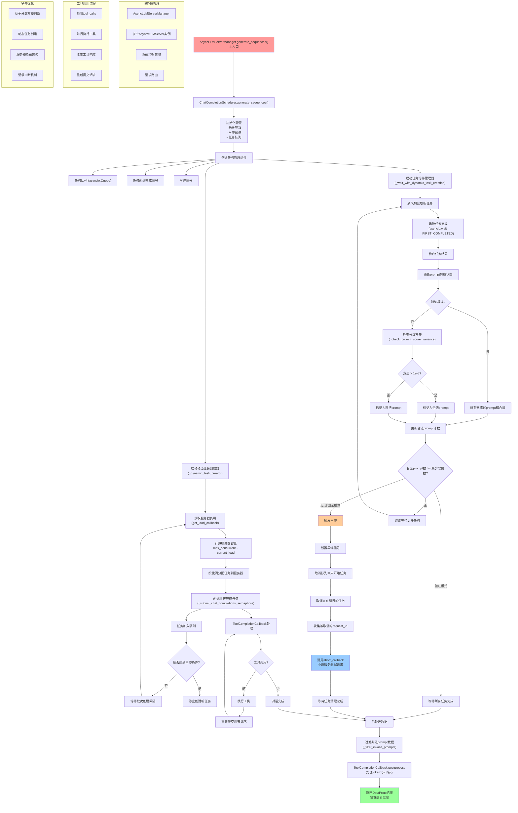

# Async DAPO with Interruption Mechanism

这是一个基于打断机制的异步DAPO (Direct Alignment with Preference Optimization) 强化学习方法的实现。该方法通过动态任务调度、早停机制和请求打断等技术，显著提升了大模型训练的效率和资源利用率。

## 🚀 主要特性

- **异步Rollout机制**: 使用veRL 的异步 Rollout engine
- **动态任务创建**: 根据服务器负载动态分配任务，提高资源利用率
- **和 DAPO 结合的早停策略**: 在每个 prompt rollout 结束时立即计算 reward 方差，并在收集到一个 batch 后，则停止 rollout 来避免无效计算

## 🛠️ 快速开始

### 1. 环境配置

```bash
# 安装基本依赖
pip install -e . 
pip install -U math-verify[antlr4_9_3]

# 设置环境变量
export WANDB_API_KEY=<WANDB_API_KEY>
export MODEL_PATH=<MODEL_PATH>
export VLLM_USE_V1=1
export HOME_DIR=<PATH_TO_HOME>
```

### 2. 数据准备

```bash
# 创建存储目录
mkdir -p <PATH_TO_HOME>/data/skywork_or1_1_5b_diff_sys
mkdir -p <PATH_TO_HOME>/data/aime24_sys

# 运行数据集构建脚本
python3 recipe/async_dapo/process_skywork.py --local_dir <PATH_TO_HOME>/data/skywork_or1_1_5b_diff_sys 
python3 recipe/async_dapo/process_aime24.py --local_dir <PATH_TO_HOME>/data/aime24_sys
```

### 3. 运行训练

```bash
# 启动math verify server
nohup python3 recipe/async_dapo/math_verify_service.py > /dev/null 2>&1 &

# 运行训练脚本
bash recipe/async_dapo/test_7b.sh
```

## ⚙️ 核心配置参数

### 异步Rollout配置
```bash
# 每个prompt生成的回复数量
n_resp_per_prompt=16

# 动态任务创建间隔（秒）
batch_creation_interval=10

# 每个服务器最大并发数
max_concurrent_per_server=512
```


## 🏗️ 架构设计

### 1. 整体架构图

```
┌─────────────────────────────────────────────────────────────┐
│                     DAPO Trainer                            │
├─────────────────────────────────────────────────────────────┤
│                AsyncLLMServerManager                        │
│  ┌───────────────┐ ┌───────────────┐ ┌───────────────┐    │
│  │ AsyncServer 0 │ │ AsyncServer 1 │ │ AsyncServer N │    │
│  │  (vLLM/SGLang)│ │  (vLLM/SGLang)│ │  (vLLM/SGLang)│    │
│  └───────────────┘ └───────────────┘ └───────────────┘    │
├─────────────────────────────────────────────────────────────┤
│                ChatCompletionScheduler                     │
│  ┌─────────────────────────────────────────────────────┐   │
│  │             Dynamic Task Creator                    │   │
│  │  • Load-aware task allocation                      │   │
│  │  • Batch creation with intervals                   │   │
│  │  • Early stop signal handling                      │   │
│  └─────────────────────────────────────────────────────┘   │
│  ┌─────────────────────────────────────────────────────┐   │
│  │             Task Queue Manager                      │   │
│  │  • Concurrent task processing                      │   │
│  │  • Score variance-based validation                │   │
│  │  • Request interruption support                   │   │
│  └─────────────────────────────────────────────────────┘   │
└─────────────────────────────────────────────────────────────┘
```

### 2. 异步Rollout流程图

