# Async DAPO with Interruption Mechanism

这是一个基于打断机制的异步DAPO (Direct Alignment with Preference Optimization) 强化学习方法的实现。该方法通过动态任务调度、早停机制和请求打断等技术，显著提升了大模型训练的效率和资源利用率。

## 🚀 主要特性

- **异步Rollout机制**: 使用veRL 的异步 Rollout engine
- **动态任务创建**: 根据服务器负载动态分配任务，提高资源利用率
- **和 DAPO 结合的早停策略**: 在每个 prompt rollout 结束时立即计算 reward 方差，并在收集到一个 batch 后，则停止 rollout 来避免无效计算

## 🛠️ 快速开始

### 1. 环境配置

```bash
# 安装基本依赖
pip install -e . 
pip install -U math-verify[antlr4_9_3]

# 设置环境变量
export WANDB_API_KEY=<WANDB_API_KEY>
export MODEL_PATH=<MODEL_PATH>
export VLLM_USE_V1=1
export HOME_DIR=<PATH_TO_HOME>
```

### 2. 数据准备

```bash
# 创建存储目录
mkdir -p <PATH_TO_HOME>/data/skywork_or1_1_5b_diff_sys
mkdir -p <PATH_TO_HOME>/data/aime24_sys

# 运行数据集构建脚本
python3 recipe/async_dapo/process_skywork.py --local_dir <PATH_TO_HOME>/data/skywork_or1_1_5b_diff_sys 
python3 recipe/async_dapo/process_aime24.py --local_dir <PATH_TO_HOME>/data/aime24_sys
```

### 3. 运行训练

```bash
# 启动math verify server
nohup python3 recipe/async_dapo/math_verify_service.py > /dev/null 2>&1 &

# 运行训练脚本
bash recipe/async_dapo/test_7b.sh
```

## ⚙️ 核心配置参数

### 异步Rollout配置
```bash
# 每个prompt生成的回复数量
n_resp_per_prompt=16

# 动态任务创建间隔（秒）
batch_creation_interval=10

# 每个服务器最大并发数
max_concurrent_per_server=512
```

### RewardCompletionCallback 自定义回调
本实现采用了自定义的`RewardCompletionCallback`来处理生成结果的实时评分：

- **实时评分**: 每当模型完成一个回复生成时，立即调用外部的`math_verify_service`进行数学问题验证和评分
- **并发控制**: 通过Semaphore限制同时进行的评分请求数量，避免过载外部服务
- **重试机制**: 支持指数退避的重试策略，提高服务可靠性
- **评分结果**: 返回score(分数)、accuracy(准确率)和prediction(预测结果)三个维度的评价指标
- **数据后处理**: 在`postprocess`阶段处理token化、填充和掩码生成等操作


## 🏗️ 架构设计

### 1. 整体架构图

```
┌─────────────────────────────────────────────────────────────┐
│                     DAPO Trainer                            │
├─────────────────────────────────────────────────────────────┤
│                AsyncLLMServerManager                        │
│  ┌───────────────┐ ┌───────────────┐ ┌───────────────┐    │
│  │ AsyncServer 0 │ │ AsyncServer 1 │ │ AsyncServer N │    │
│  │  (vLLM/SGLang)│ │  (vLLM/SGLang)│ │  (vLLM/SGLang)│    │
│  └───────────────┘ └───────────────┘ └───────────────┘    │
├─────────────────────────────────────────────────────────────┤
│                ChatCompletionScheduler                     │
│  ┌─────────────────────────────────────────────────────┐   │
│  │             Dynamic Task Creator                    │   │
│  │  • Load-aware task allocation                      │   │
│  │  • Batch creation with intervals                   │   │
│  │  • Early stop signal handling                      │   │
│  └─────────────────────────────────────────────────────┘   │
│  ┌─────────────────────────────────────────────────────┐   │
│  │             Task Queue Manager                      │   │
│  │  • Concurrent task processing                      │   │
│  │  • Score variance-based validation                │   │
│  │  • Request interruption support                   │   │
│  └─────────────────────────────────────────────────────┘   │
└─────────────────────────────────────────────────────────────┘
```

### 2. 异步Rollout流程图

```mermaid
graph TD
    A["AsyncLLMServerManager.generate_sequences()<br/>主入口"] --> B["ChatCompletionScheduler.generate_sequences()"]
    
    B --> C["初始化配置<br/>- 采样参数<br/>- 早停阈值<br/>- 任务队列<br/>- RewardCompletionCallback"]
    
    C --> D["创建任务管理组件"]
    D --> E["任务队列 (asyncio.Queue)"]
    D --> F["任务创建完成信号"]
    D --> G["早停信号"]
    
    D --> H["启动动态任务创建器<br/>(_dynamic_task_creator)"]
    D --> I["启动任务等待管理器<br/>(_wait_with_dynamic_task_creation)"]
    
    H --> J["获取服务器负载<br/>(get_load_callback)"]
    J --> K["计算服务器容量<br/>max_concurrent - current_load"]
    K --> L["按比例分配任务到服务器"]
    L --> M["创建聊天完成任务<br/>(_submit_chat_completions_semaphore)"]
    M --> N["任务加入队列"]
    N --> O{"是否达到早停条件?"}
    O -->|否| P["等待批次创建间隔"]
    P --> J
    O -->|是| Q["停止创建新任务"]
    
    I --> R["从队列获取新任务"]
    R --> S["等待任务完成<br/>(asyncio.wait FIRST_COMPLETED)"]
    S --> T["检查任务结果"]
    T --> LL["RewardCompletionCallback处理<br/>调用math_verify_service评分"]
    LL --> XX["更新prompt完成状态"]
    
    XX --> YY{"Eval模式?"}
    YY -->|是| ZZ["所有完成的prompt都合法"]
    YY -->|否| AAA["检查分数方差<br/>(_check_prompt_score_variance)"]
    AAA --> BBB{"方差 > 1e-8?"}
    BBB -->|是| CCC["标记为合法prompt"]
    BBB -->|否| DDD["标记为非法prompt"]
    
    ZZ --> EEE["更新合法prompt计数"]
    CCC --> EEE
    DDD --> EEE
    
    EEE --> FFF{"合法prompt数 >= Train batch size?"}
    FFF -->|是,非Eval模式| GGG["触发早停"]
    FFF -->|否| HHH["继续等待更多任务"]
    
    GGG --> III["设置早停信号"]
    III --> KKK["在调用端取消未开始和进行中的任务"]
    KKK --> LLL["收集被取消的request_id"]
    LLL --> MMM["调用abort_callback<br/>中断服务器端请求"]
    MMM --> NNN["等待任务清理完成"]
    
    HHH --> R
    
    FFF -->|Eval模式| OOO["等待所有任务完成"]
    OOO --> PPP["RewardCompletionCallback.postprocess()"]
    NNN --> PPP
    
    PPP --> QQQ["处理批次对话数据"]
    QQQ --> RRR["提取响应和评分"]
    RRR --> SSS["Token化处理<br/>- prompt左填充<br/>- response右填充"]
    SSS --> TTT["生成attention_mask和position_ids"]
    TTT --> UUU["过滤非法prompt数据<br/>(_filter_invalid_prompts)"]
    UUU --> VVV["返回DataProto结果<br/>包含评分统计信息"]
    
    subgraph "自定义回调处理"
        WWW["RewardCompletionCallback<br/>实时评分和数据处理"]
    end
    
    subgraph "外部服务"
        CCCC["math_verify_service.py<br/>(localhost:8000/score)"]
    end
    
    subgraph "早停优化"
        DDDD["基于分数方差判断有效Prompt"]
        EEEE["根据服务负载动态创建任务"]
        FFFF["中断机制"]
    end
    
    style A fill:#ff9999
    style LL fill:#ffcc99
    style GGG fill:#ffcc99
    style MMM fill:#99ccff
    style VVV fill:#99ff99
    style WWW fill:#ff99cc
    style CCCC fill:#99ff99
```

