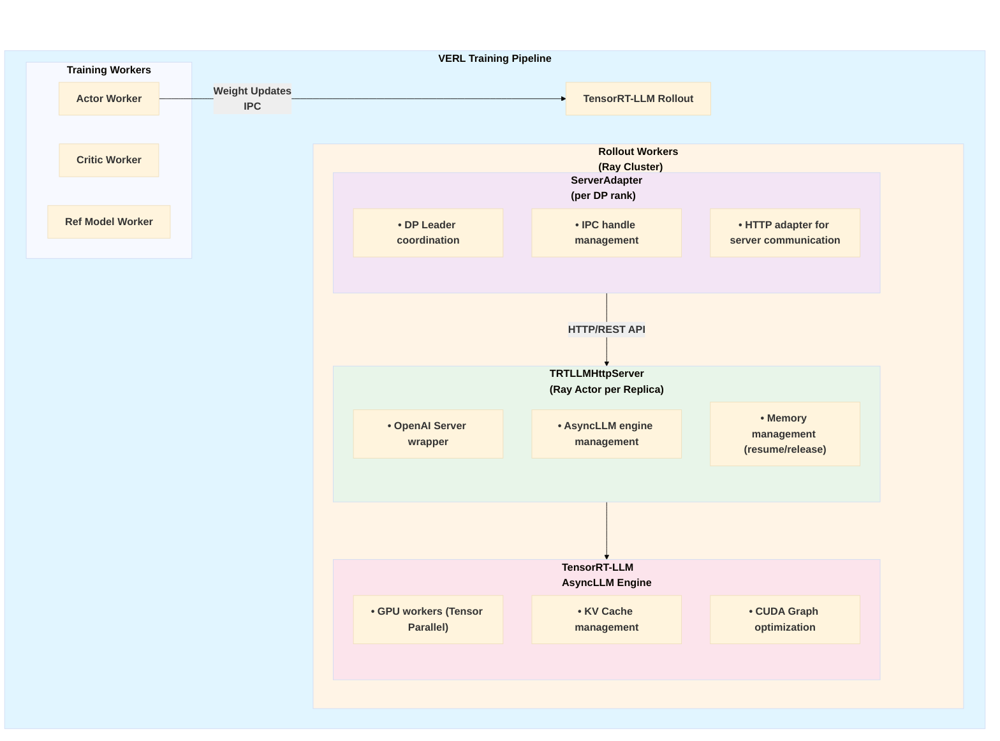
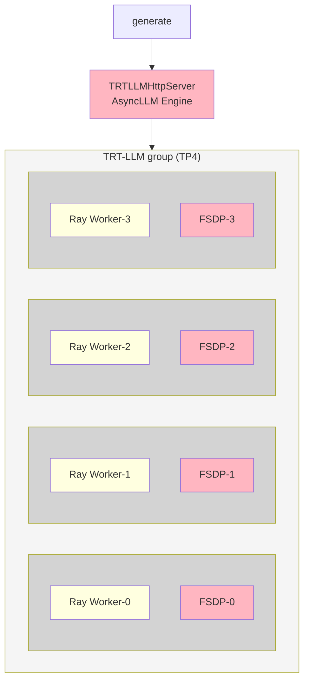
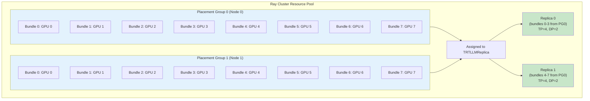
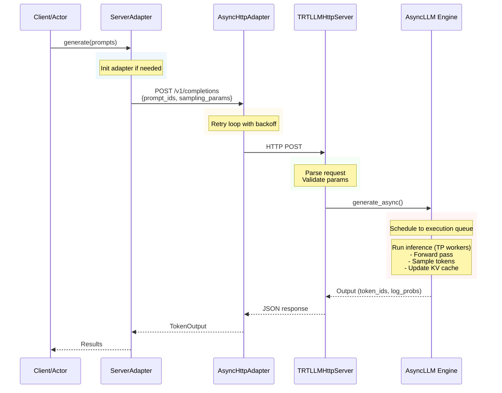

# Running VeRL with TensorRT-LLM Rollout

We provide initial support for [TensorRT-LLM](https://github.com/NVIDIA/TensorRT-LLM) as an asynchronous rollout engine in VERL's reinforcement learning pipeline. It covers key features such as distributed inference with Ray-based orchestration, dynamic weight updates via IPC (Inter-Process Communication), and efficient GPU memory management for GRPO training.

TRT-LLM rollout uses hybrid engine colocate mode, where training and inference workers are colocated on the same GPUs. Memory is managed via `resume()`/`release()` APIs to enable GPU sharing between training and inference workloads.

While the current design factors in multi-node use cases, more extensive multi-node testing and functionality will be delivered in the near future. Current focus is on FSDP and Megatron backend support for Qwen model variants.

---

## 1. Quick Start


```bash
# GRPO with FSDP training engine and TP1
>> bash examples/grpo_trainer/run_qwen2-7b_math_trtllm.sh 1
```

Note that using the TRT-LLM rollout requires setting the following environment variables before launching the Ray cluster, as included in the above script.

```bash
# Clean all SLURM/MPI/PMIx env to avoid pmix mismatch error.
for v in $(env | awk -F= '/^(PMI|PMIX|MPI|OMPI|SLURM)_/{print $1}'); do
    unset "$v"
done

# Required for IPC UUID detection
export RAY_EXPERIMENTAL_NOSET_CUDA_VISIBLE_DEVICES=1
```

## 2. Architecture Design

### 2.1 High-Level Component Diagram



### 2.2 Agent Loop Architecture

TRT-LLM rollout follows the same Agent Loop architecture described in the [VERL documentation](https://verl.readthedocs.io/en/latest/advance/agent_loop.html).

With TensorRT-LLM rollout, the AsyncLLM engine runs in the same process as the TRTLLMHttpServer (Ray actor). The engine spawns Ray workers as ModelRunner through Ray's native orchestration with placement groups.

AsyncLLM engine communicates with Ray workers through TensorRT-LLM's internal communication layer. When the server receives a request, it directly calls the AsyncLLM engine to generate response_ids. The Ray workers are separate processes from FSDP/Megatron-LM workers but are co-located on the same GPUs in hybrid engine mode.

The diagram below illustrates TRT-LLM's implementation in hybrid engine mode (Ray Workers and FSDP workers share GPUs):




### 2.3 Ray Placement Group Architecture

1. **Placement APIs & GPU Assignment**: TRT-LLM rollout leverages TRT-LLM's Ray-based APIs (`placement_groups`, `placement_bundle_indices`, `per_worker_gpu_share`) to control GPU placement. Each replica (corresponding to one `TRTLLMHttpServer`) is assigned GPU bundles from placement groups based on its replica rank and TP size.

2. **Server Placement**: `TRTLLMHttpServer` is pinned to the same node as its first bundle using `NodeAffinitySchedulingStrategy`, ensuring efficient communication between the HTTP server and its Ray workers.

3. **GPU Sharing**: In hybrid engine mode, training and inference workers share GPUs. Memory is managed via `resume()`/`release()` APIs. The resource pool uses `max_colocate_count=3` internally to support colocation of ActorRollout, RewardModel, and Critic workers.

4. **Multi-Node Design**: The placement group slicing algorithm supports spanning multiple placement groups for multi-node deployments. **Note**: Formal multi-node testing and functionality will be delivered in subsequent MRs.

The following diagram shows an example of TP=4 and DP=2. Replica 0 takes bundles 0-3 and Replica 1 takes bundles 4-7 from the same placement group, with each replica managing TP workers across its assigned bundles:



---

## 3. Core Components

### 3.1 `TRTLLMHttpServer`

**Purpose**: Ray actor that wraps TensorRT-LLM's AsyncLLM engine and exposes an OpenAI-compatible HTTP API.

**Key Responsibilities**:
- Initialize and manage AsyncLLM engine with placement group constraints
- Wrap AsyncLLM with OpenAIServer to expose HTTP endpoints
- Handle HTTP server lifecycle (launch, shutdown)
- Process generation requests with sampling parameters
- Coordinate memory management (wake_up/sleep) for GPU sharing with training workers


### 3.2 `TRTLLMReplica`

**Purpose**: Manages the mapping between replicas and Ray placement groups, orchestrating server deployment.

**Key Responsibilities**:
- Calculate placement group and bundle index assignments per replica
- Pin TRTLLMHttpServer to specific nodes using NodeAffinitySchedulingStrategy
- Launch and coordinate HTTP servers across distributed nodes
- Validate placement group configurations


### 3.3 `ServerAdapter`

**Purpose**: Rollout worker that handles weight updates, memory management, and generation via HTTP adapter.

Each DP rank has one leader (the first TP rank within that DP group), and that leader coordinates weight updates to the corresponding TRTLLMHttpServer replica.

**Key Responsibilities**:
- Act as DP leader for weight synchronization across exclude_dp mesh
- Convert PyTorch tensors to IPC handles for zero-copy weight updates
- Stream weight updates in chunks to avoid memory exhaustion
- Coordinate resume/release operations for memory management
- Initialize HTTP adapter for server communication


### 3.4 `AsyncTRTLLMHttpAdapter`

**Purpose**: HTTP client for communicating with TRTLLMHttpServer.

**Key Features**:
- Async request handling with retry logic
- Connection pooling for high throughput
- Exponential backoff on failures
- Timeout management

---

## 4. Data Flow Diagrams

### 4.1 Generation Request Flow


